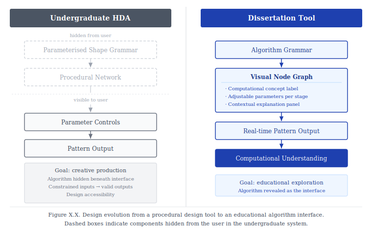

# Algorithmic Pattern Explorer

> An educational application that visualises generative algorithms to teach computational thinking through interactive pattern exploration.

---

## Overview

Algorithmic Pattern Explorer is an educational web application developed as part of an MSc dissertation investigating how interactive visualisation can support the learning of computational thinking through generative art.

Rather than treating procedural generation as a black box, the application exposes the structure of each algorithm through an interactive visual workspace. Users can manipulate parameters, inspect each stage of the generation process, and observe how computational rules influence the emergence of visual patterns in real time.

The project combines procedural graphics, algorithm visualisation and educational interface design to make generative systems more understandable and accessible.

---

## Research Questions

### Primary Research Question

> **How can interactive visualisation of generative algorithms support understanding of computational thinking concepts through pattern creation?**

### Secondary Research Question

> **How do different generative logics influence the emergence of visual structure across a spectrum from stochastic to deterministic systems?**

---

## Educational Objectives

The application is designed to help learners develop an understanding of computational thinking through direct interaction with generative systems.

Key concepts include:

* Randomness
* Iteration
* Transformation
* Symmetry
* Rule-based generation
* Parameterisation
* Emergence
* Procedural modelling
* Computational creativity

Rather than simply generating patterns, the application aims to explain **why** different algorithms produce different visual behaviours.

---

## Generative Spectrum

The project investigates four generators representing increasing levels of algorithmic constraint.

| Generator                      | Computational Approach                        | Position on Spectrum |
| ------------------------------ | --------------------------------------------- | -------------------- |
| **Perlin Noise**               | Controlled randomness                         | Stochastic           |
| **Voronoi Diagrams**           | Random inputs with deterministic partitioning | Hybrid               |
| **Escher Tessellations**       | Geometric transformations                     | Structured           |
| **Islamic Geometric Patterns** | Mathematical construction rules               | Deterministic        |

Together these demonstrate how different computational rules influence pattern formation.

---

# Educational Interface

The core contribution of the project is an interactive algorithm explorer.

Instead of exposing only parameter controls, each generator is represented as a visual workflow composed of algorithmic stages.

Users can:

* Explore the structure of each algorithm
* Manipulate parameters at individual stages
* Observe live updates to generated patterns
* Learn the computational concepts represented by each operation
* Compare stochastic and deterministic approaches

The educational interface transforms procedural generation from a hidden implementation into an explorable learning experience.

### Design Evolution

This interface design builds directly on a previous undergraduate R&D project: an Islamic geometric pattern generator implemented as a Houdini Digital Asset (HDA). That system used parameterised shape grammars to drive pattern generation, but kept the procedural graph hidden — users interacted only with a curated parameter panel, and could produce valid outputs without understanding the computational process behind them.

The dissertation inverts this approach. Rather than abstracting the algorithm away, the node-based workspace surfaces it as the primary learning object. The shift is from *design accessibility* to *educational accessibility* — from helping users use a procedural tool, to helping them understand how one works.

---

## Minimum Viable Product

### Pattern Generators

* Perlin Noise
* Voronoi Diagrams
* Escher-inspired Tessellations
* Islamic Geometric Patterns

### Algorithm Explorer

* Interactive visual workflow
* Custom algorithm nodes
* Stage-by-stage parameter editing
* Live pattern updates
* Educational explanations for each computational concept

### Export

* PNG export
* SVG export (where supported)

---

## Target Audience

The application is intended for:

* Students learning programming and computational thinking
* Learners exploring generative art
* Creative coders
* Designers interested in procedural workflows
* Educators teaching algorithmic concepts through visual media

---

## Evaluation

The project will be evaluated through user testing focusing on:

* Usability
* Learning experience
* Understanding of computational concepts
* Understanding of algorithmic workflows
* Relationship between parameter changes and visual outcomes
* Perceived educational value

---

## Technical Architecture

The application is built using a modular architecture that separates pattern generation from educational visualisation.

Core design principles include:

* Reusable generator architecture
* Modular parameter system
* Interactive node-based algorithm visualisation
* Extensible educational content
* Real-time procedural rendering
* Vector and raster export

---

## Future Work

Potential future developments include:

* User-created algorithm workflows
* Shape grammar construction tools
* Tree grammar and combinator systems
* Guided learning pathways
* Interactive tutorials
* Additional procedural generation algorithms
* Classroom activities and lesson plans

---

## Project Status

🚧 **Active MSc Dissertation Project**

Current development is focused on:

* Implementing the four core generators
* Building the React Flow algorithm explorer
* Developing the educational layer
* Designing and conducting user evaluation
